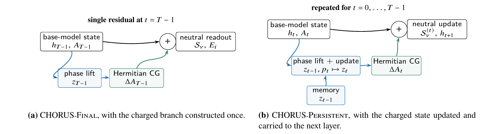
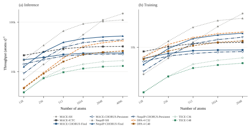
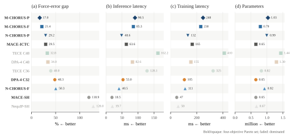

# CHORUS

### Cross-neighbour Hermitian O(3) Representations with U(1)-Structured aggregation

CHORUS is a portable Hermitian density operator for equivariant
machine-learned interatomic potentials. Equivariance determines how atomic
messages transform, and attention adapts the importance of individual edges.
CHORUS changes the next operation: how retained neighbour messages jointly
form an atomic density.

The operator lifts real equivariant edge messages to a latent unit-charge
doublet, performs coherent neighbour aggregation, and returns a neutral real
equivariant residual through Hermitian Clebsch-Gordan contraction. Relative
phase controls whether different neighbours reinforce or cancel, without
increasing message-passing depth or replacing the base model's angular
representation, interaction stack, or energy readout.

CHORUS is implemented in two distinct equivariant backbones:

- **MACE-ICTC**, which provides the primary training, compilation, and
  deployment stack;
- **NequIP**, with both the standard spherical-e3nn interaction and an
  independently implemented ICTC interaction.

Across the matched mechanism study, CHORUS lowers force MAE by
**9.5%-13.7%** over MACE-ICTC. The same density rule improves every reported
NequIP benchmark with both angular implementations, separating the operator
from a specific backbone or basis.

<p align="center">
  
</p>

## The density rule

Let $b_{ij}^{\ell m}$ be a real equivariant message from neighbour $j$ to
centre $i$. Ordinary aggregation forms

```math
A_i^{\ell m}=\sum_{j\in\mathcal N(i)} b_{ij}^{\ell m}.
```

CHORUS predicts an invariant amplitude and phase for each edge and constructs
a charged environment

```math
\psi_i^{\ell m}
=
\sum_{j\in\mathcal N(i)}
a_{ij}e^{\mathrm i\theta_{ij}}b_{ij}^{\ell m}.
```

The charged intermediate is converted back to ordinary real irreducible
representations through

```math
\Delta A_i^{LM}
=
\mathrm{CG}_{LM}
\left(\psi_i\otimes\psi_i^\dagger\right).
```

Expanding this density exposes the learned pair kernel

```math
\sum_{j,k}
a_{ij}a_{ik}
\cos\!\left(\theta_{ij}-\theta_{ik}\right)
\mathrm{CG}_{LM}
\left(b_{ij}\otimes b_{ik}\right).
```

The diagonal $j=k$ sector is a learnable quadratic self-density. The
off-diagonal $j\ne k$ sector introduces signed cross-neighbour coupling.
Together they turn neighbour reduction into learnable Hermitian density
formation.

The implementation uses two real streams,

```math
x_i=\sum_j a_{ij}\cos\theta_{ij}\,b_{ij},
\qquad
y_i=\sum_j a_{ij}\sin\theta_{ij}\,b_{ij},
```

so no complex PyTorch dtype is required. A shared low-rank channel projection
keeps the full angular-output density compact and compatible with autograd,
MakeFX, and
the existing deployment path.

## Two propagation scopes

| Scope | Charged path | Intended use |
| --- | --- | --- |
| **CHORUS-Final** | Constructed once before the final equivariant update | Default accuracy-cost configuration |
| **CHORUS-Persistent** | Updated and carried across all interaction layers | Across-depth coherent memory |

Final is the representative configuration used for mechanism, transfer, and
cross-architecture comparisons. Persistent improves six of seven reported
force conditions in the formal scope study, with its clearest gains on
Buckyball and 3BPA thermal transfer. It adds approximately 29%-30% trainable
parameters relative to Final and introduces a measurable throughput and memory
cost.

## Evidence

### Matched mechanism attribution

The controlled study uses one MACE-ICTC configuration, identical data splits,
and three matched seeds. Values are validation force MAE in
meV/Å; lower is better.

| System | CHORUS-off | Self-density $j=k$ | Density attention | Full CHORUS |
| --- | ---: | ---: | ---: | ---: |
| rMD17 benzene | 2.06 | 2.06 | 2.00 | **1.78** |
| rMD17 ethanol | 9.13 | 8.31 | 8.97 | **7.94** |
| rMD17 aspirin | 17.18 | 15.74 | 16.98 | **15.55** |
| MD22 Ac-Ala<sub>3</sub>-NHMe | 23.24 | 21.18 | 23.05 | **20.99** |
| MD22 DHA | 18.97 | 17.04 | 18.65 | **16.90** |

Self-density supplies a strong same-layer quadratic update. Restoring the
U(1)-structured off-diagonal sector improves every system and is decisive on
benzene, where the diagonal update alone is neutral.

### Transfer across backbones

The same rank-16 operator was implemented independently in MACE-ICTC and
NequIP. Widened CHORUS-off models provide capacity controls.

| Backbone | Representative comparison | Result |
| --- | --- | --- |
| MACE-ICTC | C128 CHORUS-off vs. C128 + CHORUS | Lower force MAE on Transition1x-50k, xxMD MAL, xxMD STI, and MD22 Buckyball |
| MACE-ICTC | C140 widened CHORUS-off | Additional width does not recover the CHORUS result on those four benchmarks |
| NequIP spherical-e3nn | C64 off vs. C64 + CHORUS | 9.9%-29.7% lower force MAE across all reported datasets |
| NequIP ICTC | C64 off vs. C64 + CHORUS | 9.3%-29.1% lower force MAE across all reported datasets |
| NequIP capacity control | C72 widened CHORUS-off | Parameter matching alone does not recover the CHORUS result |

The representative MACE-ICTC + CHORUS model contains
**0.672-0.792 million parameters** across the evaluated element vocabularies.
It reaches the accuracy regime of larger DPA-4 and TECE configurations while
remaining a single residual intervention on a compact equivariant potential.
Complete energy, force, parameter-count, and checkpoint-selection records are
stored under [`benchmarks/paper/results/`](benchmarks/paper/results/).

## Throughput scaling

The figure below is the strict-float32 atom-count scan used in the manuscript.
Inference and complete energy-force training steps were measured from 128 to
4096 atoms at fixed average degree 32 on one NVIDIA A100.

<p align="center">
  
</p>

CHORUS follows the same large-graph saturation profile as MACE-ICTC. From 256
to 2048 atoms, CHORUS-Final R16 retains 75%-78% of MACE-ICTC inference
throughput and 72%-76% of its training throughput. At 2048 atoms, the
representative rank-16 model uses 15.94 GiB for inference and 20.62 GiB for
training.

The timing backends are part of the reported configurations: CHORUS and
MACE-ICTC use MakeFX, DPA-4 uses compiled strict-FP32 execution, native MACE
uses CuEq, and NequIP and TECE use OpenEquivariance. Compilation time is
excluded from steady-state measurements.

## Accuracy-cost Pareto front

The following synthesis combines the seven-endpoint force-accuracy score with
strict-FP32 inference throughput, training throughput, and trainable parameter
count at 2048 atoms. Lower normalized force error, higher throughput, and fewer
parameters are preferred. Filled symbols identify the non-dominated
configurations under the plotted objectives.

<p align="center">
  
</p>

CHORUS-Final and CHORUS-Persistent occupy the accuracy-oriented part of the
frontier. The corresponding NequIP implementations show that the same density
operator produces competitive trade-offs in a distinct equivariant backbone.
The source values and front membership are stored beside the figure as CSV and
JSON.

## Installation

```bash
git clone https://github.com/Parity-LRX/CHORUS-MLIP.git
cd CHORUS-MLIP
pip install -e .
```

Optional dependencies:

```bash
pip install -e ".[pyg]"    # torch-scatter and torch-cluster
pip install -e ".[cue]"    # optional cuEquivariance products
pip install -e ".[e0]"     # fitted atomic-energy CSV support
pip install -e ".[full]"   # all optional Python dependencies
```

The distribution is `chorus-mlip`; the canonical Python namespace is
`chorus`. The runtime requires Python >= 3.9, PyTorch >= 2.4, and
`e3nn >= 0.4.4, < 0.6`.

## Quick start: MACE-ICTC backbone

The representative final-layer configuration is:

```bash
python -m chorus.cli.train \
  --data-dir DATA \
  --channels 128 \
  --lmax 2 \
  --max-ell 2 \
  --num-interaction 2 \
  --correlation 3 \
  --function-type bessel \
  --num-basis 8 \
  --product-backend ictd-bridge-u \
  --angular-basis ictd \
  --phase-mode final-full-l-residual \
  --phase-amplitude softplus \
  --phase-coefficient polar \
  --phase-context content \
  --phase-density-pairs full \
  --phase-placement pre-product-full-l \
  --phase-scope final \
  --phase-density-rank 16 \
  --phase-hidden-channels 32 \
  --phase-scale-init 0.05 \
  --device cuda \
  --dtype float32 \
  --checkpoint chorus.pth
```

Add the dataset-specific energy/force keys, atomic reference energies,
optimizer schedule, batch size, and stopping rule required by the selected
training protocol.

Useful single-variable controls:

```bash
# Ordinary backbone
--phase-mode none

# Hermitian self-density only
--phase-density-pairs diagonal

# Persistent charged stream
--phase-scope persistent

# Density-preserving attention reference
--phase-mode none --attn-heads 4 \
--attn-mode density-preserving --attn-scope final
```

## NequIP integration

The NequIP v0.6.2 integration is distributed as an auditable overlay and a
complete patch rather than a vendored copy:

```bash
git clone --branch v0.6.2 https://github.com/mir-group/nequip.git
cd nequip
git apply /path/to/CHORUS-MLIP/integrations/nequip/patches/nequip-v0.6.2-chorus.patch
pip install -e /path/to/CHORUS-MLIP
```

Minimal model configuration:

```yaml
interaction_backend: e3nn  # or ictc
chorus_enabled: true
chorus_scope: final        # or all
chorus_rank: 16
chorus_hidden_channels: 32
chorus_scale_init: 0.05
```

See [`integrations/nequip/README.md`](integrations/nequip/README.md) for
provenance, configuration fragments, tests, and Slurm launchers.

## Reproducing the benchmarks

- [`benchmarks/paper/README.md`](benchmarks/paper/README.md) describes the
  curated result tree.
- [`benchmarks/paper/REPRODUCE.md`](benchmarks/paper/REPRODUCE.md) records the
  evaluation and reporting protocol.
- [`benchmarks/paper/scripts/training/`](benchmarks/paper/scripts/training/)
  contains the accuracy campaigns.
- [`benchmarks/paper/scripts/throughput/`](benchmarks/paper/scripts/throughput/)
  contains the strict-float32 atom-count scan.
- [`chorus/bench/bench_phase_hermitian.py`](chorus/bench/bench_phase_hermitian.py)
  benchmarks the Hermitian operator in eager and MakeFX execution.

Large checkpoints, datasets, raw training logs, and trajectories are not
stored in Git. Lightweight machine-readable summaries and plotted records are
retained.

## Symmetry scope

CHORUS realizes an internal
$\mathrm{O}(3)\times\mathrm{U}(1)$ representation during neighbour
aggregation. A common rotation of the charged doublet leaves the Hermitian
density invariant, while edge-dependent phase differences control signed
cross-neighbour contributions. This is a latent global U(1) symmetry of the
charged stream; it is not an assignment of atomic charge or a local gauge
connection between spatial frames.

## Repository layout

```text
CHORUS-MLIP/
  chorus/                    # canonical package and MACE-ICTC implementation
  integrations/nequip/       # NequIP e3nn/ICTC overlay and complete patch
  benchmarks/paper/          # reproducible scripts and lightweight results
  docs/                      # manuals, design notes, and README assets
  lammps_user_mfftorch/      # LAMMPS USER-MFFTORCH deployment package
```

## License

The source code is released under the MIT License. Separately distributed
datasets and pretrained models may use different terms.
